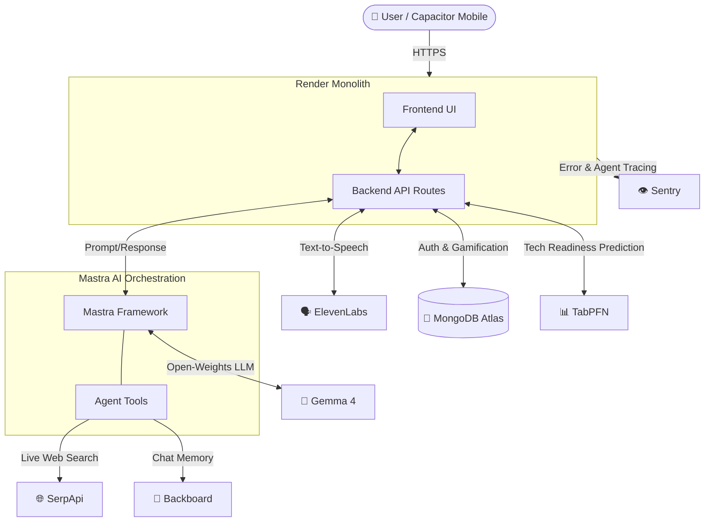

  # 🐧 DigiPico

  **A gamified, mobile-first AI learning companion designed to cure tech intimidation.**
  
  
  
  
  
  
   

## 🏗️ Architecture

## 📖 Overview

**DigiPico** was built for the [Hacktoberfest Weekend Challenge: Build for a Friend](https://dev.to/challenges/hacktoberfest-weekend-2026-10-01). 

The goal? To help a non-technical friend fall in love with technology. Traditional tutorials feel like reading a dry textbook, and code editors are cold and unforgiving. DigiPico solves this by disguising tech education as a welcoming, interactive mobile game. 

Guided by **Pico**—an empathetic, open-weights AI penguin tutor—users can explore complex computer science concepts through bite-sized paths, test their knowledge with dynamic quizzes, and write real code in a safe JavaScript sandbox to earn XP and unlock achievements!

---

## ✨ Key Features

- 🐧 **Adorable AI Persona:** Powered by **Gemma 4**, Pico is explicitly prompted to be warm, non-judgmental, and encouraging.
- 🎮 **Deep Gamification:** Every action (completing a lesson, passing a quiz, running code without errors) awards XP. Track your login streaks and unlock database-backed achievements.
- 🧩 **Dynamic Learning Paths:** The AI generates custom, structured JSON curriculums based entirely on the user's personal interests (e.g., "Robotics", "React", "AI").
- 💻 **Interactive JS Sandbox:** An integrated code editor allows users to execute real JavaScript directly in the browser. The AI dynamically generates custom coding challenges for them to solve.
- 📱 **Mobile-First & Capacitor Ready:** The UI is meticulously crafted for smartphone screens and is fully integrated with **Capacitor** to be bundled as a native iOS/Android app.

---

## 🛠️ The Tech Stack (Partner Integrations)

This project heavily utilizes specialized partner technologies to achieve a complex architecture in a single weekend:

* **[Mastra](https://mastra.ai/):** The open-source agent framework orchestrating the AI logic, tool calling, and structured JSON generation.
* **[Gemma 4](https://ai.google.dev/):** The open-weights LLM (`gemma-4-26b-a4b-it`) powering Pico's brain and preventing rigid corporate RLHF from ruining the fun.
* **[MongoDB Atlas](https://www.mongodb.com/):** The primary database handling auth, gamification states, and curriculum caching.
* **[Backboard](https://backboard.com/):** Effortlessly persists the agent's memory and chat threads so Pico always remembers the user.
* **[SerpApi](https://serpapi.com/):** A custom Mastra tool that allows Pico to search the live web for beginner-friendly tech news and hackathons.
* **[TabPFN](https://github.com/automl/TabPFN):** Tabular machine learning used to predict a user's "Tech Readiness Score" based on their XP and streak.
* **[ElevenLabs](https://elevenlabs.io/):** Text-to-Speech API giving Pico a cute, expressive voice in the chat.
* **[Sentry](https://sentry.io/):** Full-stack error tracking and agent tracing to ensure a crash-free experience.
* **[GitHub Copilot](https://github.com/features/copilot):** Accelerated the development of the entire UI and backend architecture through AI pair programming.
* **[Render](https://render.com/):** The monolithic Next.js application is seamlessly deployed as a Web Service using a declarative `render.yaml` blueprint.

---

## 🚀 Installation & Setup

Want to run DigiPico on your own machine or deploy it to the cloud? 

It's incredibly easy! All instructions for environment variables, local development, and Render deployment have been moved to their own dedicated guide.

👉 **[Read the full SETUP.md Guide here](./SETUP.md)**

---

  <i>Built with ❤️ for Hacktoberfest 2026</i>

